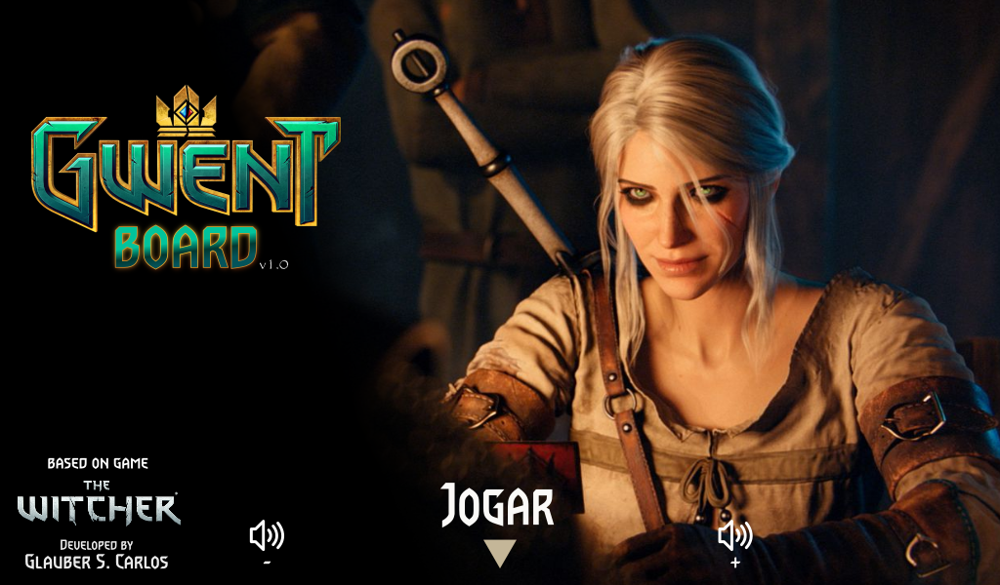
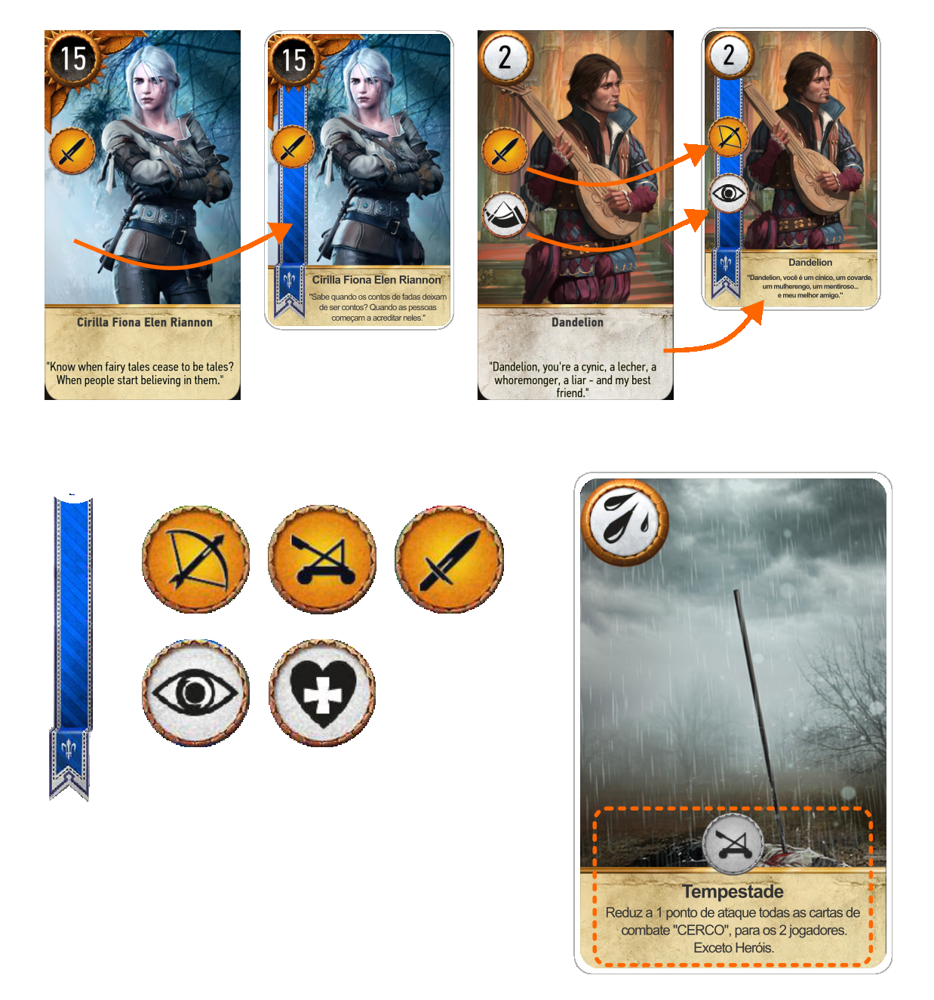
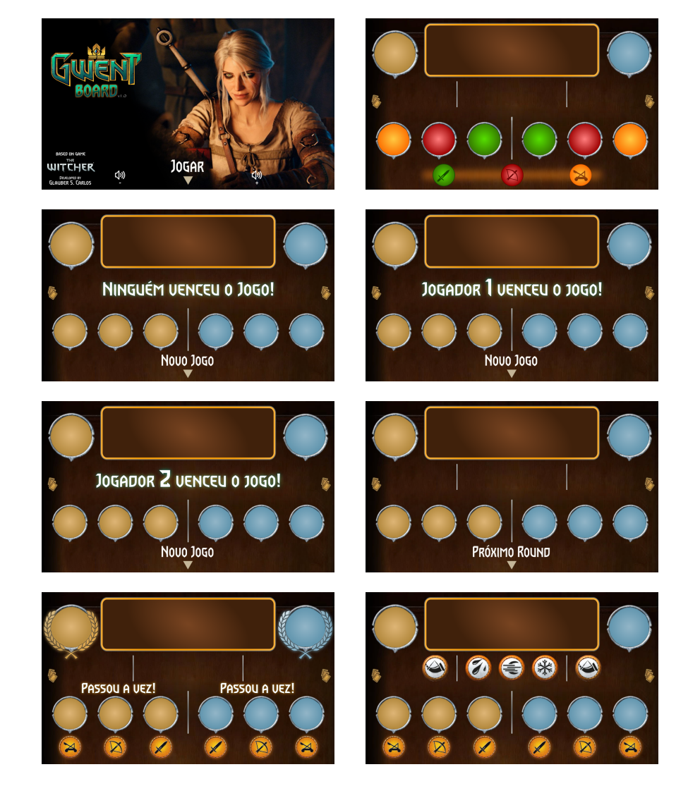

# 🧩 Projeto: Gwent Board
"Gwent Board" é o projeto de um tabuleiro para 2 jogadores que mistura interações físicas e digitais.
É baseado inteiramente no jogo Gwent, na sua versão presente em The Witcher 3 - Wild Hunt, com ligeiras modificações.

---

⚠️ Direitos:
- Gwent e The Witcher são marcas registradas, bem como suas artes, regras, músicas e quaisquer outras criações. 
O projeto não pode ser vendido e não possui fins lucrativos. O projeto "Gwent Board" é destinado ao aprendizado e diversão pessoal.

---

## 📝 Lista de peças

- Raspberry Pi 3 Model B
- Módulo NFC RC522
- Cartões NFC
- Módulo Amplificador de Áudio I2S MAX98357A
- Alto-falante 3w 4ohms
- LED WS2812B
- Switches NO com LED
- Display HDMI 7"
- Fonte de alimentação 5V 2.5A
- Cabos HDMI e USB
- Componentes eletrónicos (resistores, capacitores, fios, jumpers)

---

## 🧰 Programação

Python, os pacotes principais são:
- pygame, RPi.GPIO, rpi_ws281x, mfrc522.
---
## ⚙️ Processo de criação/construção

- Criei a lógica de programação e algoritmos, obtive muito auxílio do ChatGPT com a linguagem Python, bem como a instalação das libs e interação com os pacotes e dispositivos.
- As orientações de eletrónica e ligações ao Raspberry pi foram dados pelo ChatGPT.
- As músicas em background são originais do jogo Gwent, versão "The Witcher 3 - Wild Hunt".
- Alguns efeitos sonoros são originais do jogo Gwent, outros são sons genéricos editados.
  
📌
- O design 2D das cartas, impressão e adesivos;
- A organização das cartas em JSON;
- O design apresentado no display;
- O projeto do tabuleiro e a impressão em 3D;
- A gravação dos desenhos no tabuleiro.
  
Todos esses trabalhos foram feitos por mim.

| Design Cartas |
|------------------------|
|  | 
| Excel com parâmetros das Cartas |
|  |
| Design Display |
|  |
| Gravações no tabuleiro |
|  |

---

## ⚙️ Lógica de funcionamento

- A programação é dividida em módulos em python. 
- O módulo main.py é responsável pelo loop principal do jogo, enquanto os demais módulos executam ações adicionais ou controlam dispositivos eletrónicos.
- O arquivo JSON contém todos os dados das cartas.
  
| Diagrama |
|------------------------| 
|  |
- As setas duplas indicam que o módulo recebe e envia informações.
- Os módulos verdes possuem sua própria execução. O led_process.py é separado pois precisa de permissão especial.

| JSON |
|------------------------| 
|  |

---
## 🎯 Jogo em si

As regras do jogo são similares ao do jogo Gwent original, com a exceção de algumas cartas, que estão ausentes.
Fluxo explicado abaixo:

- Jogo por turnos. Cada carta jogada passa pelo sensor, que contabiliza a pontuação, realiza uma função específica ou aguarda alguma decisão do jogador.
- A carta jogada deverá ir para o local determinado.
- A rodada acaba quando ambos os jogadores "passam a vez". O jogador sem cartas passa a vez automaticamente.
- Quem tiver maior pontuação vence a rodada.
- As cartas da rodada recém-terminada vão para o lixo.
- Inicia-se uma nova rodada com as cartas que sobraram nas mãos.
- Quem vencer mais rodadas (de 3), ganha o jogo.
  
---

## 🔍 Simulação de cartas no tabuleiro
| Carta "herói" junto com uma carta comum, na mesma fileira |
|------------------------| 
|  |

| Simulação da pontuação, caso alguma destas cartas especiais fossem usadas |
|------------------------| 
|  |

| Outras cartas especiais que também não afetam a carta "herói" |
|------------------------| 
|  |

--- 

## ✨ O jogo possui lógicas de proteção para evitar erros e jogadas indevidas. 
Por exemplo: Não é possível repetir cartas; a leitura duplicada é protegida; não é possível jogar cartas não permitidas no momento, etc...

## Imagens e Vídeos reais

## Próximos passos.

💡 🖼️ 📌 🌐 🛠️ ✅ 🚧 📬 👤 ℹ️ 🧭 📱 🖨️ 🚀 

